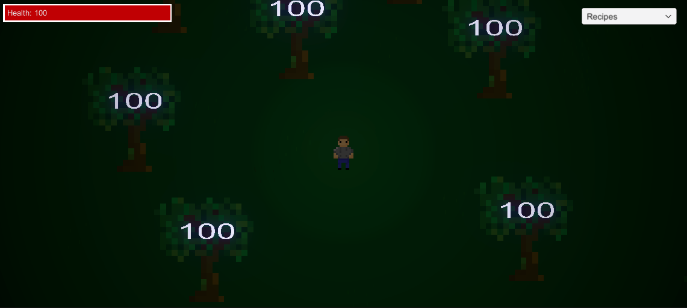
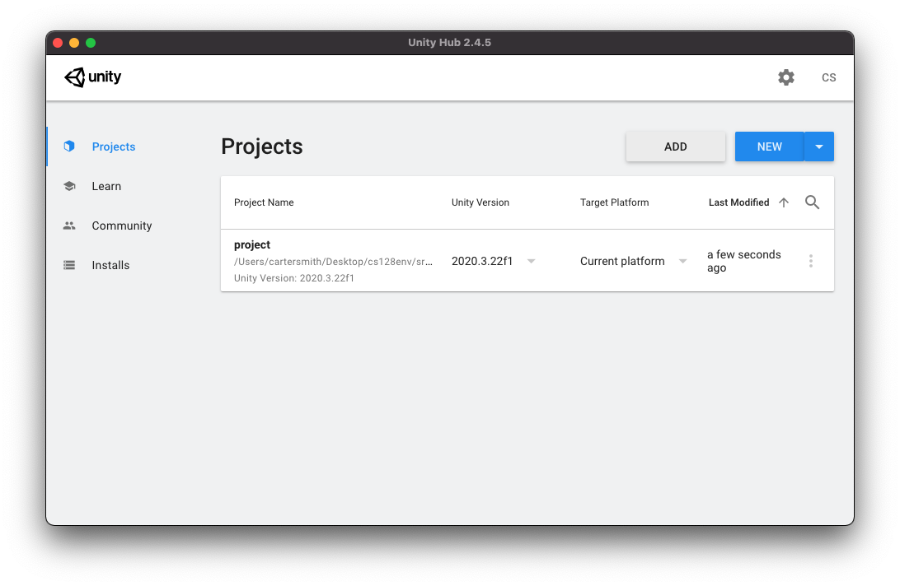
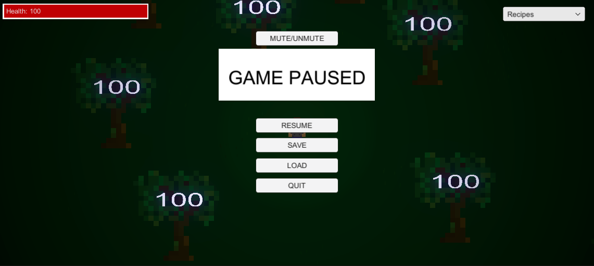

<div id="top"></div>
<!-- PROJECT LOGO -->
<br />
<div align="center">
  <a href="https://github.com/cs128-2021c/final-project-segfaultcoredumped">
    
  </a>

<h3 align="center">Forest Forever</h3>

  <p align="center">
    Group: SegFaultCoreDumped
    <br />
    <a href="https://github.com/cs128-2021c/final-project-segfaultcoredumped/releases"><strong>Release Binaries »</strong></a>
    <br />
    <br />
    <a href="https://github.com/cs128-2021c/final-project-segfaultcoredumped/issues">Report Bug</a>
    ·
    <a href="https://github.com/cs128-2021c/final-project-segfaultcoredumped/issues">Request Feature</a>
  </p>
</div>

<!-- TABLE OF CONTENTS -->
<details>
  <summary>Table of Contents</summary>
  <ol>
    <li>
      <a href="#about-the-project">About The Project</a>
      <ul>
        <li><a href="#built-with">Built With</a></li>
      </ul>
    </li>
    <li>
    <a href="#features">Features</a>
    </li>
    <li>
      <a href="#getting-started">Getting Started</a>
      <ul>
        <li><a href="#prerequisites">Prerequisites</a></li>
        <li><a href="#installation">Installation</a></li>
      </ul>
    </li>
    <li><a href="#usage">Usage</a></li>
    <li><a href="#roadmap">Roadmap</a></li>
    <li><a href="#build-creation-overview">Build Creation</a></li>
    <li><a href="#unit-testing-overview">Unit Testing</a></li>
    <li><a href="#contributors">Contributors</a></li>
  </ol>
</details>

<!-- ABOUT THE PROJECT -->
## About The Project



Forest Forever is a top-down RPG style game which integrates an inventory/crafting system, mining, and enemies to provide a full game experience for users. Through a minimalistic UI, users can collect resources and craft them into tools to advance the game. The game also implements saving to allow for games to be saved and loaded at a later point in time.

<p align="right">(<a href="#top">back to top</a>)</p>

### Built With

* [Unity](https://unity.com/)
* [NUnit](https://nunit.org/)
* [Background images by Rowdy41](https://rowdy41.itch.io/small-forest)

<p align="right">(<a href="#top">back to top</a>)</p>

<!-- FEATURES -->
## Features
* GUI 
    * Save/load/pause game
    * Inventory
    * Crafting
* Death and respawn mechanics
    * Combat w/enemies
* Collision and lighting system
* Health system w/regeneration

<p align="right">(<a href="#top">back to top</a>)</p>

<!-- GETTING STARTED -->
## Getting Started

To locally develop and test the game, follow these steps.

### Prerequisites

This is an example of how to list things you need to use the software and how to install them.

* Unity Hub
    * [Signup for Unity student plan](https://unity.com/products/unity-student)
        * [Download for Windows](https://public-cdn.cloud.unity3d.com/hub/prod/UnityHubSetupBeta.exe?_ga=2.265867014.86822971.1638815185-478218458.1636753186)
        * [Download for Mac](https://public-cdn.cloud.unity3d.com/hub/prod/UnityHubSetupBeta.dmg?_ga=2.265867014.86822971.1638815185-478218458.1636753186)

### Installation

1. Clone the repository.

   ```sh
   git clone https://github.com/cs128-2021c/final-project-segfaultcoredumped
   ```

2. Add project on Unity Hub by clicking open and select the "final-project-segfaultcoredumped\unity-folder\project" folder.

   

<p align="right">(<a href="#top">back to top</a>)</p>

<!-- USAGE EXAMPLES -->
## Usage
* Save Screen
    

<p align="right">(<a href="#top">back to top</a>)</p>

<!-- ROADMAP -->
## Roadmap

* [x] Entity collision
* [x] Inventory system
* [x] Enemies
* [x] Health and player stats
* [x] User interface
* [x] Saving
* [] Multiple levels
* [] Various types of attacks

See the [open issues](https://github.com/cs128-2021c/final-project-segfaultcoredumped/issues) for a full list of proposed features/issues.

<p align="right">(<a href="#top">back to top</a>)</p>

<!-- Build Creation Overview -->
## Build Creation Overview

### Notice:
Under releases on the right within this GitHub repository, there is a build which we compiled into an executable and uploaded as a .zip file. It is recommended to use this build. To use the build v0.11, download the .zip file, unzip the file, and the executable file and game directories are all setup, ready to play!

### Creation:
To create a custom build of the project, open the project in the Unity editor. Then, double click the GameScene1.unity scene located in Assets>Scenes. Finally, press Control+Shift+B and then select desired build settings. For our project, we used default build settings and pressed "Build and Run".

<p align="right">(<a href="#top">back to top</a>)</p>

<!-- Unit Testing Overview -->
## Unit Testing Overview


### Preface: 
An install of the Unity Editor (VERSION 2020.3.22f1) is required to execute the unit testing for this project. However, it should be noted that all testing scripts are available in the project folder (in \final-project-segfaultcoredumped\unity-folder\project\Assets\Scripts) and all test results are provided (in \final-project-segfaultcoredumped\unity-folder\unit-testing).

We made comprehensive unit tests for the required gameplay functions outlined in our project proposal.

Our final project implements Unity's built-in "Test Runner" to build our unit testing.
Basically, Unity utilizes two types of tests: "EditMode" and "PlayMode" testing.

### EditMode - tests scripts outside of the game runtime environment
### PlayMode - tests game functionality/scripts within the game runtime environment

Each individual folder contains test results generated by our unit test code which can be located
at: \final-project-segfaultcoredumped\unity-folder\project\Assets\Tests

The unit tests can be ran outside of the Unity Editor through command lines such as Command Prompt on Windows and Terminal on MacOS.

Template Command Line (Windows): [CD to where Unity.exe is located]Unity.exe -runTests -batchmode -projectPath [Project Directory] -testResults [Save Directory] -testPlatform [EditMode/PlayMode]

Template Command Line (MacOS): /Applications/Unity/Unity.app/Contents/MacOS/Unity -runTests -batchmode -projectPath [Project Directory] -testResults [Save Directory] -testPlatform [EditMode/PlayMode]

Example Command Line Used Locally: Unity.exe -runTests -batchmode -projectPath C:\Users\safeer\cs128env\src\fp\final-project-segfaultcoredumped\unity-folder\project -testResults C:\Users\safeer\cs128env\src\fp\final-project-segfaultcoredumped\unity-folder\unit-testing\edit-mode-results\results.xml -testPlatform editmode


*(C:\Program Files\Unity\Hub\Editor\2020.3.22f1\Editor) is the default Windows save path*

*(/Applications/Unity/Unity.app/Contents/MacOS/Unity) is the default MacOS save path*

***The Unity.exe editor cannot be open when batchmode commandlines are called!***


### Note: 
Be patient as the tests run. Some tests require up to 20-30 seconds minimum to execute. When using the commandline method, the only indicator that the test is done executing is when the results.xml file is updated to the chosen save directory.

### Alternative: 
Rather than running the tests through batchmode command lines, tests can be directly ran within the Unity editor. Directions: Open the project in the Unity editor, click Window>General>Test Runner.

<p align="right">(<a href="#top">back to top</a>)</p>

<!-- CONTRIBUTORS -->
## Contributors

* Safeer Ahmed
* Daniel Feng
* Carter Smith
* Ben Evanoff

<p align="right">(<a href="#top">back to top</a>)</p>
